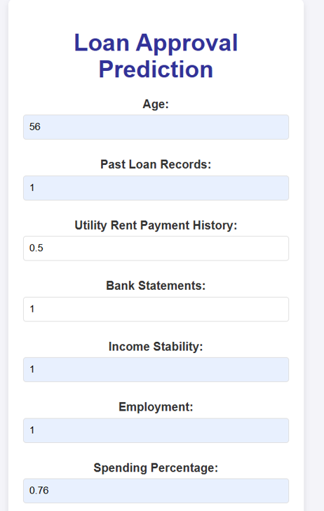

# LOAN-APPROVAL-PREDICTOR

## 🚀 Overview
This project helps individuals with unconventional financial backgrounds, such as freelancers, self-employed individuals, and newcomers, access loans by using diverse financial data instead of relying solely on traditional credit scores.

## ✨ Features
- **Alternative Data Sources**: Analyzes phone bills, rent payment history, spending habits, and more.
- **Smart Decision-Making**: Uses machine learning models for accurate and fair assessments.
- **Inclusive Approach**: Designed for those without conventional credit histories but who show financial responsibility.

## 🔍 Why This Project?
Traditional loan systems overlook diverse financial situations. This project:
- Utilizes alternative data points for evaluation.
- Offers fair opportunities to all borrowers, regardless of background.

## 📚 Research Gap
Current systems focus on credit scores or limited alternative data. This project stands out by:
- Combining multiple non-traditional data sources.
- Using advanced machine learning for personalized loan assessments.

## 🛠️ Technologies Used
- **Programming Language**: Python  
- **Models**: Logistic Regression, Random Forest, K-Nearest Neighbors  
- **Libraries**: Pandas, NumPy, Scikit-learn, Matplotlib

## 👩‍💻 How It Works
1. Input data such as rent history, spending patterns, and phone bills.  
2. Process data using machine learning models.  
3. Generate loan eligibility decisions.

